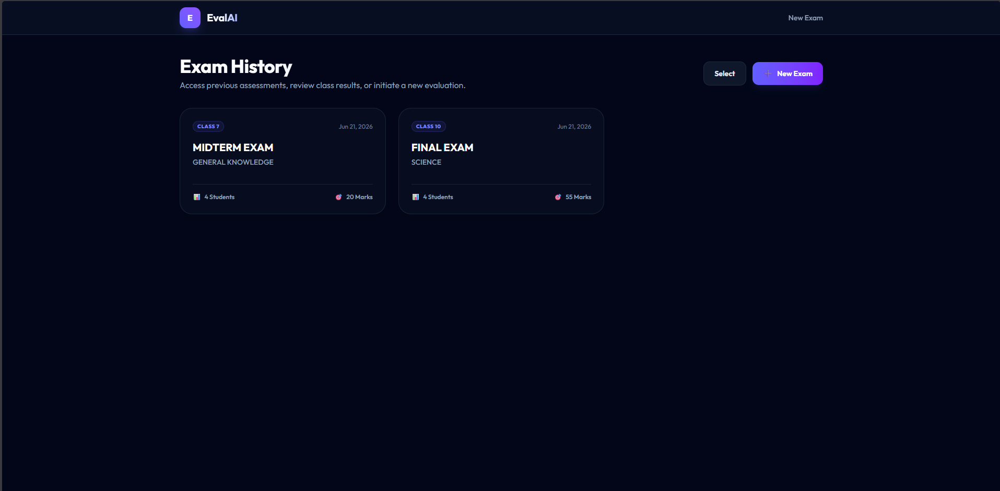
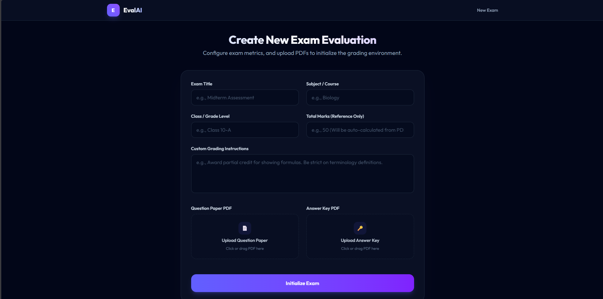
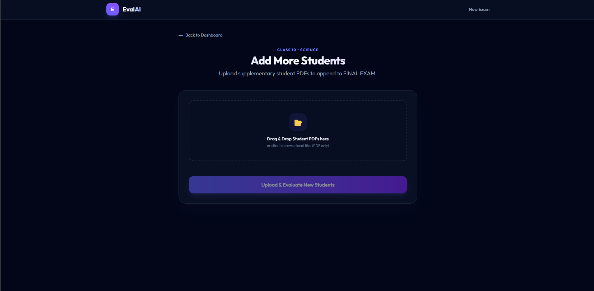
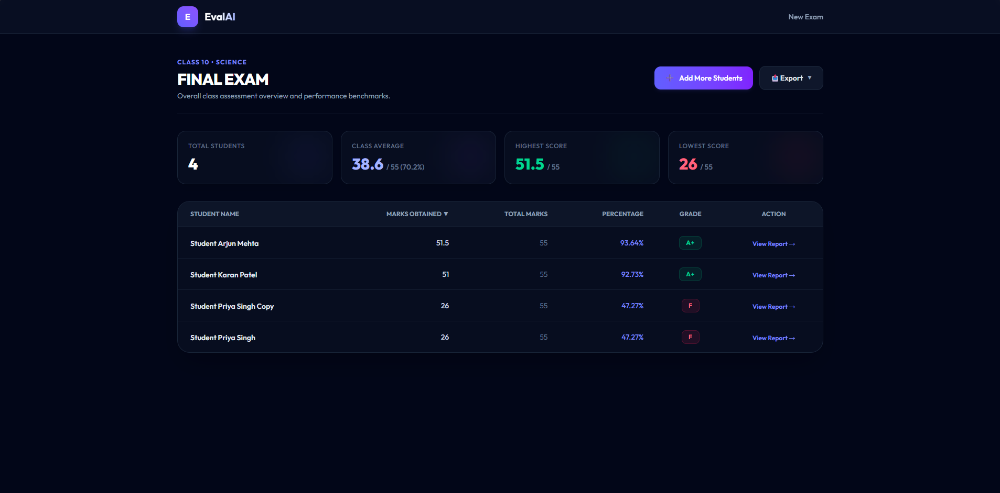
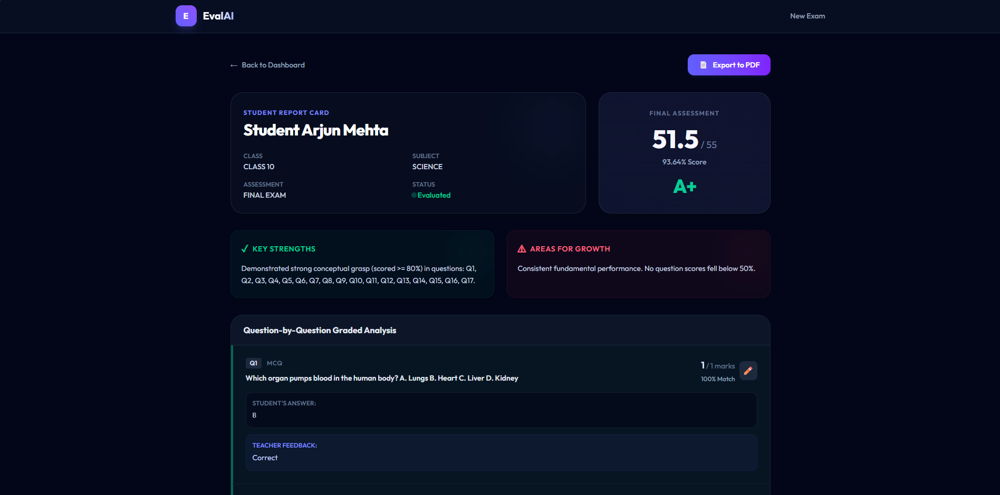
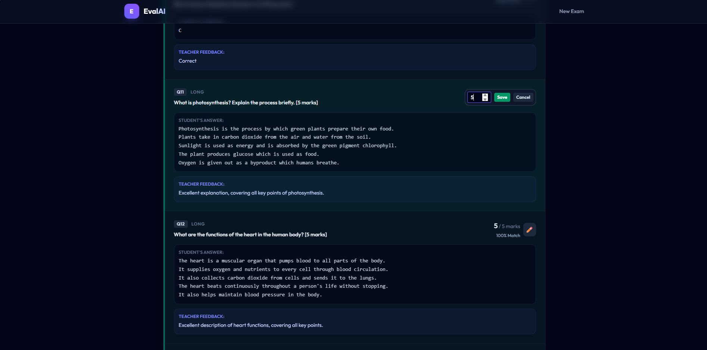
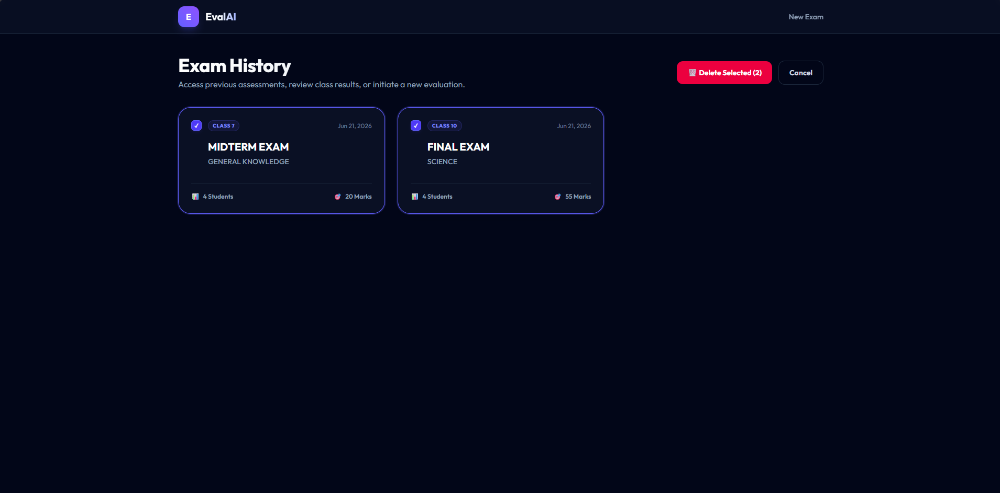

# EvalAI — AI-Powered Exam Evaluation Platform

> Built for school teachers. Powered by Groq LLM. Designed to save hours of manual grading.

EvalAI is an intelligent answer sheet evaluation platform that automatically grades typed student PDF answer sheets against a question paper and reference answer key. It understands meaning — not just keywords — so students get fair, consistent marks even when their wording differs from the model answer.

---

## What It Does

Traditional exam grading is slow, inconsistent, and exhausting. EvalAI changes that.

Upload a question paper, an answer key, and a batch of student answer sheets. EvalAI reads every answer, evaluates it against the key using AI, awards marks — including partial marks for theory — and generates a full class dashboard with individual student breakdowns, all in minutes.

- **MCQ questions** are graded by exact answer matching — fast and deterministic
- **Theory questions** are evaluated semantically — the AI understands what the student meant, not just what they wrote
- **Partial marks** are awarded based on completeness and conceptual accuracy
- **Consistent standards** are maintained across every student in the batch

---

## Key Features

- **Bulk PDF Upload** — Upload 100+ student answer sheets at once, each as a separate PDF
- **AI Semantic Evaluation** — Theory answers graded by concept, not keyword matching
- **Mixed Question Support** — Single exam can contain MCQs, short answers, and long answers
- **Class Dashboard** — Sortable results table with scores, percentages, and grades at a glance
- **Individual Student Reports** — Question-by-question breakdown with feedback for each student
- **Manual Mark Override** — Teachers can adjust any AI-awarded mark with a single click
- **Exam History** — All past exams saved and accessible anytime
- **Add Students Anytime** — Upload more student sheets to an existing exam after evaluation
- **Export Results** — Download class results as Excel or individual reports as PDF
- **Delete Exams** — Select and permanently remove one or more exams from history

## Screenshots

### Exam History


---

### New Exam Setup


---

### Student Upload


---

### Class Dashboard


---

### Student Report


---

### Manual Mark Override


---

### Delete Exam Feature


## How It Works

<table>
<tr>

<td align="center">
<b>Teacher Uploads</b><br><br>
<code>Question Paper  </code><br>
<code>Answer Key      </code><br>
<code>Student Sheets  </code><br>
<code>PDF per student </code>
</td>

<td align="center"><b>&nbsp;&nbsp;──▶&nbsp;&nbsp;</b></td>

<td align="center">
<b>EvalAI Processes</b><br><br>
<code>Parse questions </code><br>
<code>Extract marks   </code><br>
<code>Map answers     </code><br>
<code>AI evaluation   </code>
</td>

<td align="center"><b>&nbsp;&nbsp;──▶&nbsp;&nbsp;</b></td>

<td align="center">
<b>Teacher Receives</b><br><br>
<code>Class Dashboard </code><br>
<code>Student Reports </code><br>
<code>Excel Export    </code><br>
<code>PDF Reports     </code>
</td>

</tr>
</table>

**Phase 1 — Understanding the Exam**
The system parses the question paper to extract every question, its marks, and its type. The answer key is mapped question by question. The AI now understands the full exam structure before touching a single student sheet.

**Phase 2 — Evaluating Student Answers**
Student sheets are parsed and each answer is mapped to its question. For MCQs, answers are compared directly. For theory, all students' answers for the same question are sent to Groq in batches — ensuring consistent marking standards across the entire class.

**Phase 3 — Results & Reporting**
Scores are compiled per student, percentages and grades are calculated, and a full interactive dashboard is generated. Teachers can review, override, and export results.

---

## Tech Stack

| Layer | Technology |
|---|---|
| Frontend | React, Tailwind CSS, React Router |
| Backend | Node.js, Express |
| Database | SQLite (via better-sqlite3) |
| AI Evaluation | Groq API (llama3 model) |
| PDF Parsing | pdf-parse |
| File Uploads | multer |
| Excel Export | SheetJS |
| PDF Export | jsPDF |

---

## Getting Started

### Prerequisites
- Node.js v18 or higher
- A free [Groq API Key](https://console.groq.com)

---

### Step 1 — Backend Setup

```bash
cd answer-evaluator/backend
npm install
```

Create a `.env` file in the backend folder:

```env
PORT=5000
GROQ_API_KEY=your_groq_api_key_here
```

Start the backend server:

```bash
node index.js
```

Backend runs at `http://localhost:5000`

---

### Step 2 — Frontend Setup

```bash
cd answer-evaluator/frontend
npm install
npm run dev
```

Frontend runs at `http://localhost:5173` — open this in your browser.

---

## Grading System

**MCQ Rules**
- Correct answer → Full marks
- Incorrect answer → Zero marks
- No partial marking for MCQs

**Theory Rules**
- AI evaluates based on conceptual understanding
- Partial marks awarded in increments of 0.5
- One-line feedback provided per question
- Consistent standards maintained across all students

**Grade Scale**

| Percentage | Grade |
|---|---|
| 90 – 100% | A+ |
| 80 – 89% | A |
| 70 – 79% | B |
| 60 – 69% | C |
| 50 – 59% | D |
| Below 50% | F |

---

## Student Answer Sheet Format

For best results, student PDFs should follow this format:

```
Name: Student Name
Roll No: 001

Q1. Answer: B
Q2. Answer: C

Q11.
Student's written answer for theory question here...

Q12.
Another theory answer here...
```

The system auto-detects question numbers and answer formats. MCQ answers can include tick/cross symbols and are handled correctly.

---

## Project Structure

```
answer-evaluator/
├── backend/
│   ├── database/
│   │   ├── db.js                      # SQLite connection and auto-init
│   │   └── schema.sql                 # Table definitions
│   ├── routes/
│   │   ├── exam.js                    # Exam setup and parsing endpoints
│   │   ├── upload.js                  # Student sheet upload handling
│   │   ├── evaluate.js                # Evaluation trigger and results
│   │   └── export.js                  # PDF and Excel export streaming
│   ├── services/
│   │   ├── pdfParser.js               # PDF text extraction
│   │   ├── questionParser.js          # Question and marks extraction
│   │   ├── answerParser.js            # Student answer mapping
│   │   ├── groqEvaluator.js           # Groq LLM evaluation with retry
│   │   ├── evaluationOrchestrator.js  # Full evaluation pipeline
│   │   └── reportGenerator.js        # Excel and PDF report generation
│   ├── index.js                       # Server entry point
│   └── .env.example                   # Environment variable template
└── frontend/
    ├── src/
    │   ├── pages/
    │   │   ├── ExamHistory.jsx        # All past exams listing
    │   │   ├── Setup.jsx              # New exam creation
    │   │   ├── Upload.jsx             # Student sheet upload
    │   │   ├── AddStudents.jsx        # Add more students to existing exam
    │   │   ├── Dashboard.jsx          # Class results dashboard
    │   │   └── StudentReport.jsx      # Individual student breakdown
    │   ├── config.js                  # API base URL config
    │   ├── App.jsx                    # Routes and navigation
    │   └── main.jsx                   # React entry point
    ├── index.html
    └── vite.config.js
```

---

## Important Notes

- Student answer sheets must be **typed PDFs** — handwritten or scanned sheets are not supported in this version
- Only **English language** answers are supported
- Maximum recommended batch size is **100 students per exam**
- The Groq free tier has rate limits — large batches are processed in groups with automatic retry on rate limit errors
- All data is stored **locally** on your machine — no student data is sent to any external server except the answer text sent to Groq for evaluation

---

## License

This project was built as an educational tool for school examination management.
